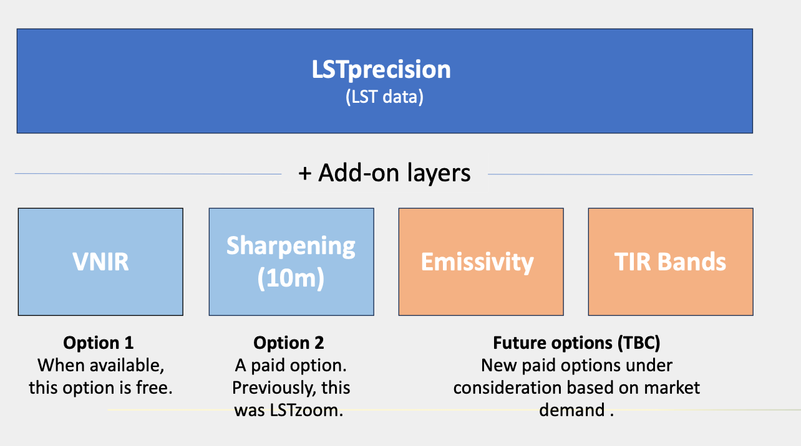

# **Constellr's product offer** 

Our data portfolio consists of **one LST product with multiple add ons** that help you maximize insights from land surface temperature (LST). Benefit from our cutting edge proprietary data layers for high-frequency and high resolution monitoring of your area of interest. 

  

 

<h2>When should you use LSTprecision?</h2>
- *Protect high-value assets:* Get asset-level insights with accurate thermal data, not just rough indices or proxies. 
- *Stay ahead of risks:* Our system acts as an early-warning tool, spotting stress in environments, infrastructure, and materials before damage occurs. 
- *Rely on unmatched temperature accuracy:* With absolute precision of < 2K, you can trust your data to be consistent, comparable, and reliable over time. 
- *See what others miss:* A sensitivity of 0.03K uncovers subtle thermal shifts, ensuring confident detection of both relative and absolute changes. 
- *Track trends with confidence:* High-frequency revisits (as often as every 3 days in daylight) deliver rich time-series data, enabling timely identification of anomalies and long-term patterns. 

