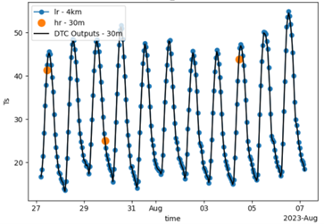

# Constellr DTC

Constellr-DTC provides hourly Land Surface temperature data at 30-meter resolution. 

## Overall Objectives 

The goal is to model the daily fluctuation in Land Surface Temperature (LST) at the highest spatial resolution possible. The primary advantage of this methodology is its ability to fusion multiple LST data sources at different resolutions. In other word, we're using constellr-DTC as a data fusion method between high resolution images (Landsat and Ecostress) and high temporal resolutions images (Mosaic of various geostationary satellites) to output high temporal and spatial resolution images. 

## The input data to constellr-DTC

### High temporal resolution images - geostationary satellites 

The constellr-DTC model will require a time-series of hourly LST measurements from a geostationary satellite over multiple days. That data usually comes from GOES, SEVIRI and HIMAWARI missions. 

### High Spatial resolution images - polar orbital satellites 

The second type of input refers to high spatial resolution data from polar orbital satellites, typically Landsat and Ecostress. Data from the constellr Hive mission will be integrated as soon as it is available.  

## Specification

| Product Specifications                |                       |
|---                                    |----:                  |
| Spatial resolution (m)                | 30                    |
| Frequency                       | Hourly        |
| Coverage                              | Worldwide             |
| Used data sources                     |Geostationary Satellites (Goes, Seviri, Himawari) + Landsat and Ecostress |

## Constellr-DTC methodology 

The general steps leading to generate the diurnal temperature cycle modelling data are listed below. 

1- Parameter initialization 

2- Low resolution Fitting 

3- High Resolution Fitting 

 
*For further details concerning the methodology, please contact the constellr product team.  

{: style="height:300px"}
<figcaption id="dtc inputs" tag="image">hourly Low-res data (lr -4km) and sporadic High-res data (hr-30m) over a ten-day period </figcaption>

{: style="height:300px"}
<figcaption id="dtc modeling" tag="image">Constellr-DTC outputs (hourly LST at 30m) over a ten-day period </figcaption>

## File-naming convention

LST layers are provided and follow this compact naming convention:

YYYYMMDDTHHMMSS_DTC.tif

Where

- YYYYMMDDTHHMMSS is the datatake sensing time of the land surface temperature in isoformat. Time is based on Universal Time Coordinated (UTC), also known as Greenwich Mean Time (GMT).

- DTC is the model name
  
- .tif is the geospatial raster format used to store the data
