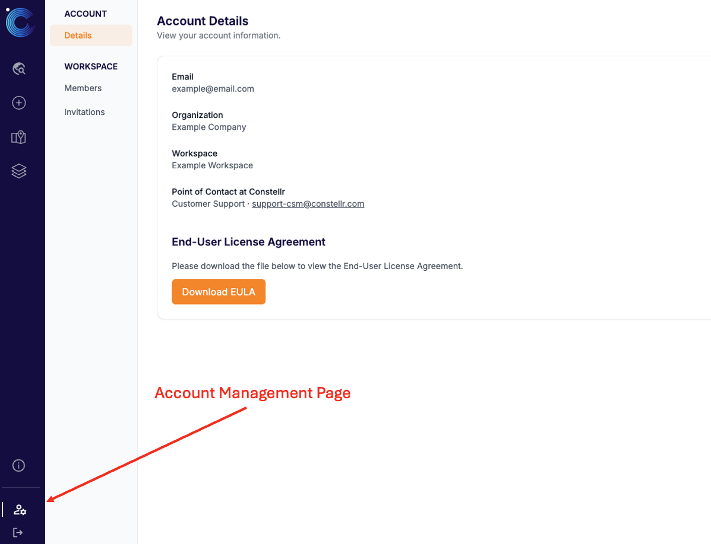
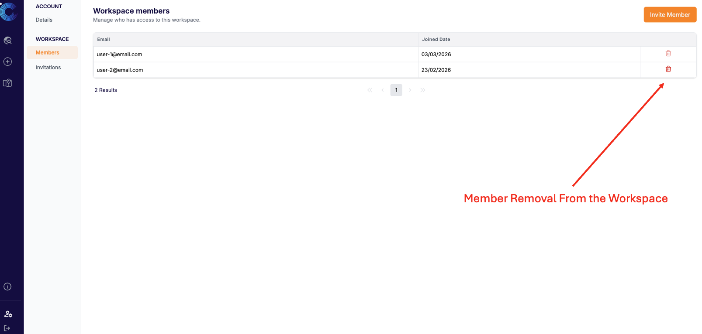
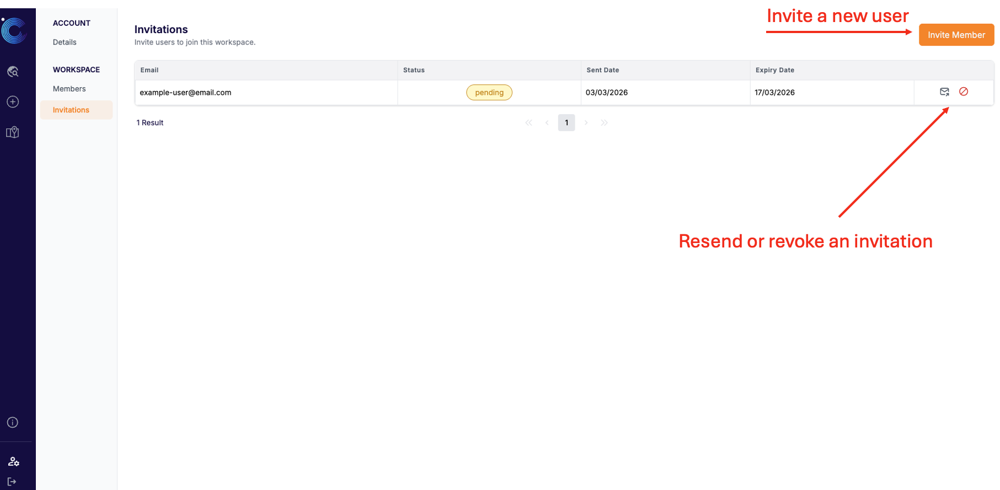
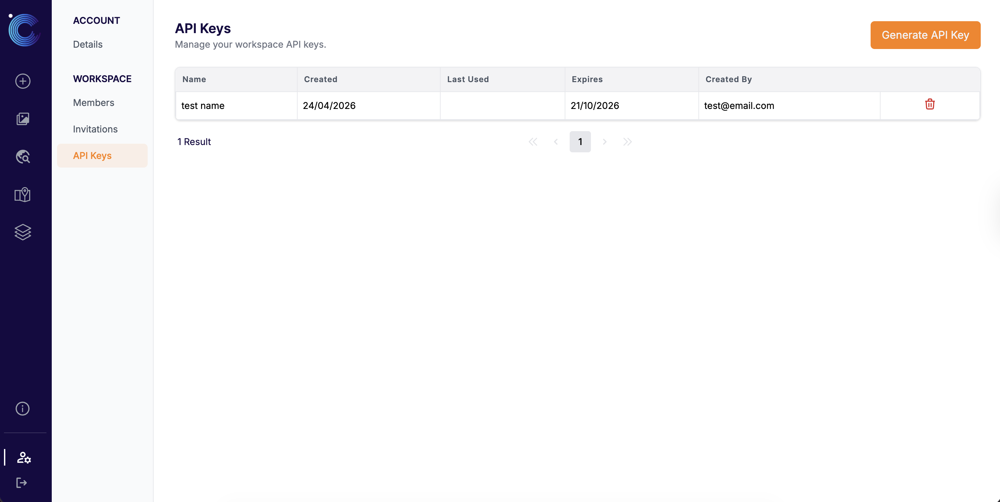
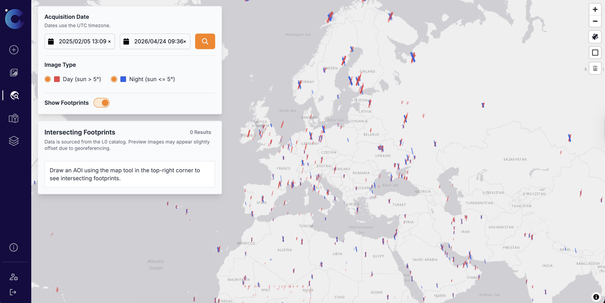
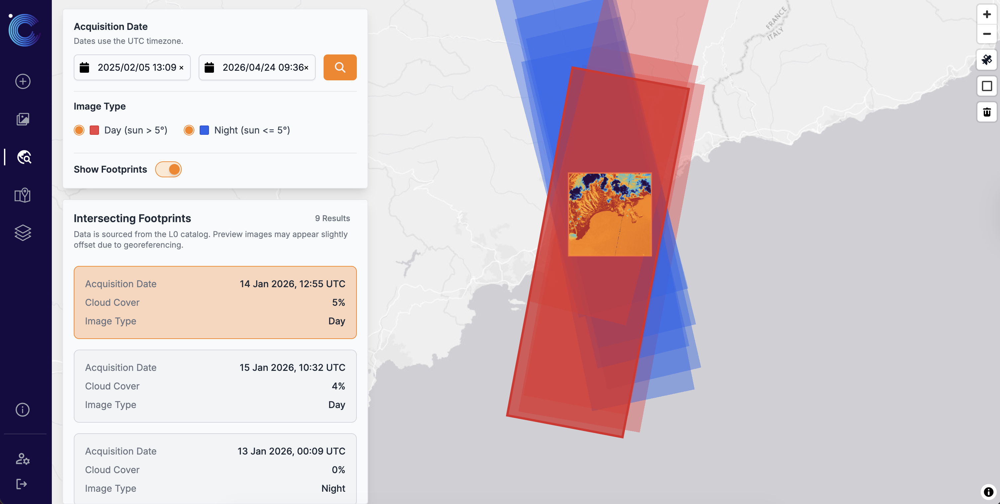

# **End User Platform - UI Documentation**

This page will guide you through the steps to create an account, access it, and browse through the delivery page.
<!-- > **Note:** If your organisation is registered with constellr, you can create an account for free. -->

## **Login & Account Access**

You can access the End User Platform via the [Sign In](https://app.constellr.com/signin) page using your registered email and password.

---

!!! info "Invitation-Only Access"
    To ensure strict data isolation and security, the platform is **invitation-only**. You cannot sign up independently; access must be granted to a specific **Workspace** by a workspace member or a constellr Customer Success Manager (CSM).

**Getting Started**

If you are new to the platform or joining a new workspace, follow these steps:

**1. Receive an Invitation**

An existing workspace member or a constellr Customer Success Manager (CSM) must send an invitation to your email address.

**2. Accept the Invite**

Click the link provided in your invitation email. The system will determine your next step based on whether you already have an account:

* **New Users:** You will be prompted with a sign-up form to provide your email and password. You must read and accept the Terms and Conditions to proceed.
* **Existing Users:** Simply sign in with your current credentials to automatically add the new Workspace to your account.

**3. Verify Your Account (New Users Only)**

To finalize your account creation, you must enter a **verification code** sent to your email:

* This code is valid for **24 hours**.
* Once verified, your account is activated, and you can proceed to sign in.

**4. Choose Your Workspace**

Because the platform supports multi-tenancy, you may belong to multiple independent workspaces.

* **Single Workspace:** You will be logged in directly to that workspace.
* **Multiple Workspaces:** After signing in, you will be prompted to select which Workspace you wish to enter. In order to switch between workspaces, you can log out and log back in to select a different workspace.

---

> **Need Help?** > If you haven't received an invitation or need technical assistance, please contact your project lead or our support team at [support-csm@constellr.com](mailto:support-csm@constellr.com).
>
## **Navigating the End User Platform**

There are four main sections in the platform, which you can access from the sidebar on the left:  

* **My Data**: Access your data and track your orders.  
* **New order**: Place a new order.
* **AOI Library**: Create and manage your Areas of Interest.
* **Account & Workspace Settings**: Manage your personal profile and control team access.
* **Archive**: Browse and preview data from the L0 catalog.

<h3>My Data</h3>
This is the central place for tracking your data orders and downloading your data.  

**Tracking Orders**  
A table shows an overview of all orders you have placed, including their status, area of interest, product, and monitoring period. At the top of the page, you can search and filter your orders to quickly find the data you need.  

{ width=80% }

Each row in the table represents one data order with the following information:  

* **Data Order ID**: The unique identifier for the order.  
* **State**: You can use this to track where the order is in it’s lifecycle:
  * *Pending Validation* – waiting for validation by constellr CSMs.
  * *In Progress* – the order is active and the system is working to acquire and deliver images to you.  
  * *Closing* – this status is triggered when the monitoring period is over. The system is no longer trying to acquire new images. However, we are waiting for any last images taken by the satellite to be downlinked, processed and quality controlled before the order closes.  
  * *Closed* – the order is complete and all of your data has been delivered.
* **Area of Interest**: The AOI being imaged for this order.
* **Frequency**: How often data is delivered to you (e.g. *Single Image, Weekly, Monthly*). This is a *target* frequency rather than a guaranteed frequency. The real frequency of deliveries may vary based on when acquisitions can take place, cloud coverage, satellite availability etc.  
* **Product**: The selected product type for the order (*LSTprecision, LSTzoom, LSTfusion*).
* **Monitoring Period**: The time window for which data is collected.  

**Downloading Data**  
You can access your data by clicking on the Data Order ID. Here, you can see every delivery for that order.  

Each delivery is named according to when the image was acquired by the satellite. You can expand each delivery to see the files inside of it, and download each delivery by using the download icon at the bottom.  

{ width=80% }

<h3>New Order</h3>
To place a new order, you can navigate to the [New Order](https://app.constellr.com/new-order) tab. Here, you can simply fill in the order details as prompted. You can submit multiple orders at a time by clicking the  ‘Add Order’ button before submission. You can also duplicate or remove an order by clicking on the three dots on the top right of each order box.

Upon successful submission, you will receive a confirmation message. Your order will also be visible in the table on the My Data tab.  

{ width=80% }

<h3>AOI Library</h3>
This page is under construction and provides limited functionality for the moment.  

From the [AOI Library](https://app.constellr.com/aoi-library) tab, you can manage the AOIs that you have defined. You can see the name, creation date and size. You can also download the GeoJSON by clicking the three dots on the upper right of each AOI.  

From this page, you can create new AOIs that can be reused when creating orders. You can either draw an AOI or upload a GeoJSON file. Each AOI in your account must have a unique name.  

For GeoJSON uploads, we accept `Feature`, `FeatureCollection`, `Polygon`, or `MultiPolygon`, each containing exactly one polygon.  

{ width=80% }

<h3>Account & Workspace Settings</h3>
You can access your account and workspace settings here: [Account and Workspace Settings](https://app.constellr.com/account).

**Account Details**

The **Account Details** page provides a quick overview of your profile, including your registered email, organization, and active workspace. You can also find contact information for your dedicated CSM and download the **End-User License Agreement (EULA)**.

{ width=80% }

**Workspace Management**

Workspaces are the core unit of data isolation and access control in the platform. Each workspace represents a separate tenant with its own data and user membership.
You can manage team access via the **Workspace** section in the **Account** page. In order to create a new workspace, please contact your CSM.

**Members**

The **Members** tab lists everyone currently authorized to access the active workspace.

* **Remove Members**: Click the trash can icon to immediately revoke a user's access to this workspace.

{ width=80% }

**Invitations**

The **Invitations** tab controls access for new users through secure, email-based invites.

* **Invite Member**: Use the "Invite Member" button to send an access link to a colleague.
* **Track Status**: Monitor if an invitation is *Pending* or *Expired*.
* **Manage Invites**: Use the action icons to resend an invitation email or revoke an unused invitation.

{ width=80% }

**API Keys**

The **API Keys** section allows workspace users to create and manage API credentials for programmatic integrations. You can access it by navigating to [Account > Workspace > API Keys](https://app.constellr.com/account/workspace-api-keys).

From this page, you can generate a new API key by providing a name, view your existing keys in a paginated table, and delete a key to immediately revoke access.

!!! warning API Key shown only once
    The generated key value is displayed **only once** at the time of creation. Make sure to copy it immediately and store it securely, as it cannot be retrieved afterwards.

A few important things to keep in mind:

* A user can have only **one active API key** at a time.
* If the key creator is removed from the workspace (or their account is deleted), all keys created by that user are automatically revoked.
* Deleting a key is irreversible — any integrations relying on that key will stop working immediately.

{ width=80% }

<h3>Archive Browser</h3>

The **Archive Browser** provides an interactive map interface to explore available archive footprints and inspect imagery overlaps for a selected area of interest (AOI). You can access it from the main sidebar as [Archive](https://app.constellr.com/archive).

{ width=80% }

To get started, use the quick square drawing tool to place a 15 km × 15 km AOI. The browser will display all intersecting footprints for your selected area. You can then:

* Filter results by **acquisition date range** (UTC)
* Filter by **image type** (*Day* and/or *Night*)
* Toggle footprint visibility on the map
* Select a footprint to inspect its metadata and load a crop preview

> **Note:** Archive results are based on the L0 catalog. Preview images may appear slightly offset due to georeferencing.

{ width=80% }
