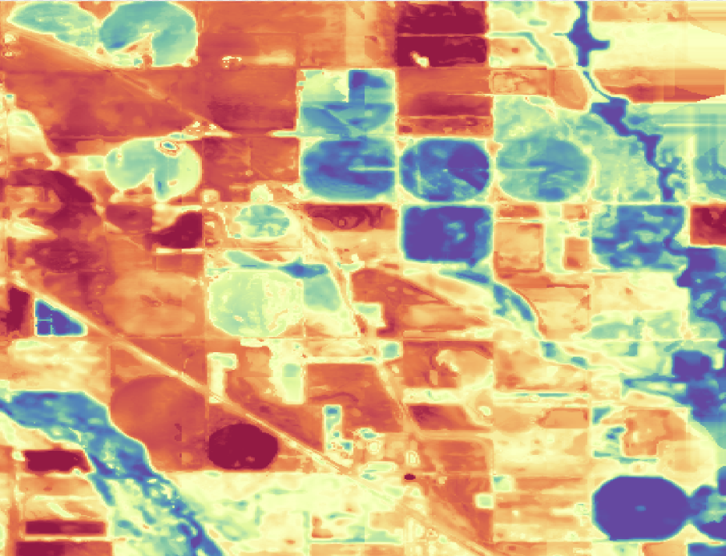
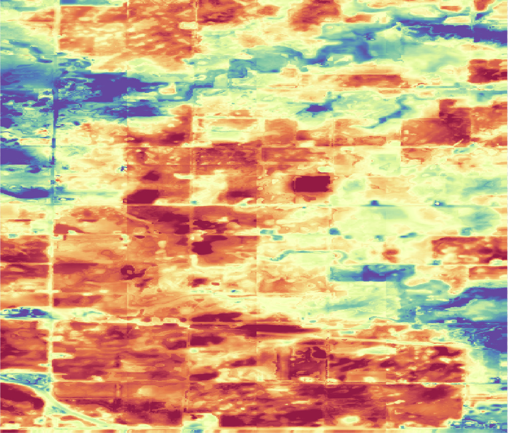

# Explorer Lab
Do you want to get started using land surface temperature to derive temperature-based insights? Explore our collection of demo datasets below. Get an impression of the datasets we deliver, our data quality, and test data integration. Each dataset includes the LST data layer, cloud masks and meta data files for each observation date over a given area of interest. 

<!-- - [Brasil Rioverde Fields](https://constellr-products-shared.s3.eu-central-1.amazonaws.com/br-rioverde-2023.zip)
- [Brasil Barreiras Fields](https://constellr-products-shared.s3.eu-central-1.amazonaws.com/br-barreiras-2023.zip)
- [France Marne Fields](https://constellr-products-shared.s3.eu-central-1.amazonaws.com/fr-marne-2023.zip)
- [US Pontiac Fields](https://constellr-products-shared.s3.eu-central-1.amazonaws.com/us-pontiac-2023.zip)
- [Germany Freiburg/Breisgau, Urban/Forest/Agriculture](https://constellr-products-shared.s3.eu-central-1.amazonaws.com/germany_freiburg_breisgau-urban-forest-agriculture.zip) -->

## Demo data for use cases

-   :fontawesome-brands-envira:{ .lg .left }  __A water stress story__

    ---

    {: style="height: 200px; width: 200px; object-fit: cover;"}

    * Kansas, US
    * April - July 2022
    * [LST30 product](Technical-specification.md)
    * Degree Kelvin
  
    [Detecting water stress using spaceborne LST](water-stress-use-case.md)
    
 

## LST30
Our current offer entails fusioned land surface temperature data layers from a variety of data sources. It leverages our in-house developed proprietary emissivity and retrieval algorithms for enhanced data quality. The product is available for different surface areas today re-sampled at a 30m spatial resolution. 

-   :fontawesome-brands-envira:{ .lg .left }  __Bare Soil__

    ---

    {: style="height: 200px; width: 200px; object-fit: cover;"}

    * Iowa, US
    * April - June 2022
    * 30 meter spatial resolution
    * Degree Kelvin

    [:octicons-download-16: Download](https://public-data-213979744349.s3.eu-central-1.amazonaws.com/Explorer-lab/constellr-baresoil_monitoring2022.zip)

-    :material-home-city:{ .lg .left }  __Urban__
     
    ---
  
    {: style="height: 200px; width: 200px; object-fit: cover;"}

    * Toulouse, France
    * 16th June 2021
    * 30 meter spatial resolution
    * Degree Kelvin

    [:octicons-download-16: Download](https://public-data-213979744349.s3.eu-central-1.amazonaws.com/Explorer-lab/toulouse_LST30.zip)    

## High-precision LST - available by 2025
Upon launch of our own satellites, we will have an exclusive high-precision LST data layer available with enhanced accuracy on a 30m native spatial resolution. The simulated dataset below has been generated using airborne thermal infrared sensors and is compatible with our geospatial data product next year. Get a glimpse into the improved data quality of our land surface temperature product already today!

-   :material-home-city:{ .lg .left }  __Urban__

    ---

    {: style="height: 200px; width: 200px; object-fit: cover;"}

    * Hive synthetic data
    * Toulouse, France
    * 30 meter spatial resolution
    * 16th June 2021
    * Degree Celsius
    * [License](https://doi.org/10.1016/j.dib.2023.109109)
    

    [:octicons-download-16: Download](https://public-data-213979744349.s3.eu-central-1.amazonaws.com/Explorer-lab/constellr-toulouse_hive_synthetic2021.zip)

 

