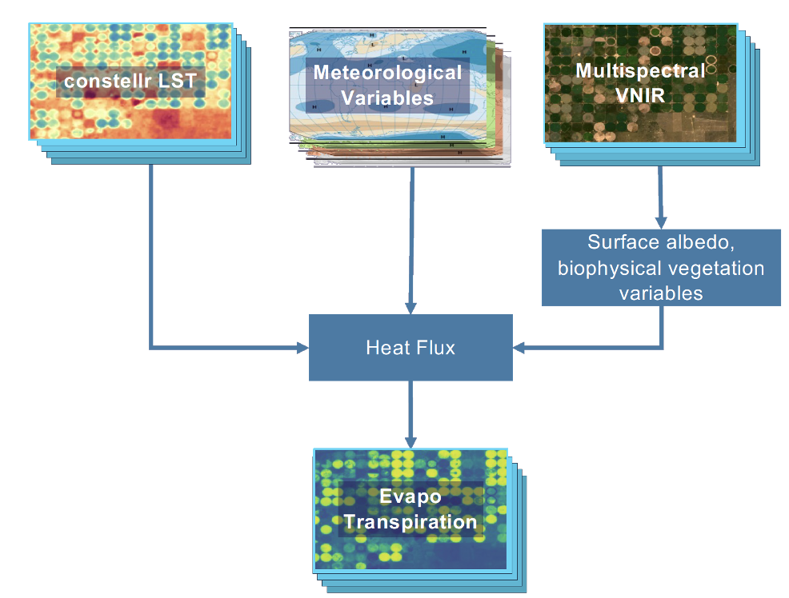

# Constellr ET

Evapotranspiration (ET) by Constellr is estimated using two models:
Priestly-Taylor Jet Propulsion Laboratory (PTJPL) and Two-source model
energy balance (TSEB). The results of each model are provided to empower
the end-user in selecting the best approach suitable to their needs.
This output sheet contains description of the various provided layers.

## Background

Evapotranspiration (ET) refers to the flow of water leaving the ground
surface per unit of time. It has two main components: vegetation
transpiration and soil evaporation. Therefore, ET supports the
estimation of water consumption and water needs and is used to create
efficient water budgets at various scales.

The evapotranspiration (ET) provided by Constellr is based on remote
sensing data and meteorological data. The input data used to estimate
instantaneous ET, also know as latent heat flux, is:

-   Land surface temperature: The [LST30](./lst.md) service of Constellr
    provides a combined repository of spaceborne acquired land surface
    temperature from various sensors.

-   Spaceborne data acquired using the visible and near-infrared parts
    of the spectrum (VNIR): Open spaceborne data is leveraged to provide
    the best estimations of bio-physical vegetation parameters.

-   Meteorological data: From local meteorological stations to global
    atmospheric reanalysis datasets, Constellr assess temporal and
    spatial data availability to provide the best input to the ET
    models.

{: style="height:250px"}
<figcaption id=et_flow tag="image">et flow</figcaption>

{: style="height:250px"}
<figcaption id=et_flux tag="image">et flux</figcaption>

## Specification

| Product Specifications                |                       |
|---                                    |----:                  |
| Spatial resolution (m)                | 30                    |
| Frequency(days)                       | 8                     |
| Coverage                              | Worldwide             |
| Used data sources                     | Public mission        |
| Latency time after data acquisition   | 12h                   |  
| Period of availability                | June 2018 - ongoing   |
| Thematic accuracy                     |  1.5-3K               |
| Spatial accuracy                      | <1 pixel              |

## File-naming convention

Various layers are provided and follow this compact naming convention:

YYYYMMDD_aa_bb.tif

where

-   YYYYMMDD is the datatake sensing date of the land surface temperature in isoformat.  
    Date is based on Universal Time Coordinated (UTC), also known as Greenwich Mean Time (GMT).

-   aa can be either LE (instantaneous ET) or ET (daily estimate)

-   bb is the method name, PTJPL or TSEB

-   .tif is the geospatial raster format used to store the data

Thus, file *20220728_ET \_PTJPL.tif* identifies a daily ET
product estimated using PTJPL acquired by a thermal sensor on the July
28, 2022 UTC

