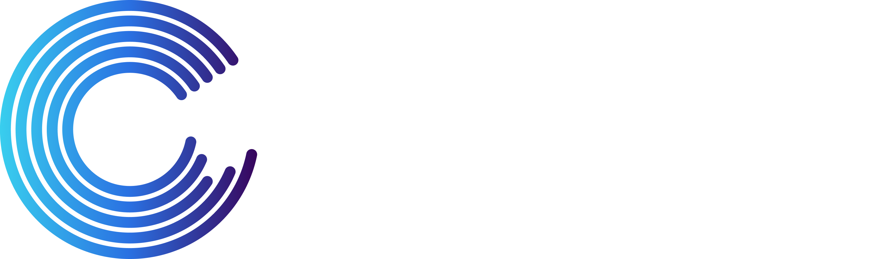

<!DOCTYPE html>
<html lang="en">
<head>
<meta charset="UTF-8">
<meta name="viewport" content="width=device-width, initial-scale=1.0">
<link href="stylesheets/extra.css" rel="stylesheet">
</head>

</html> 

<!-- # <strong>The Knowledge Center</strong>
<h3><i>Where you will find everything you need to know about constellr's LST data</i></h3> -->

  

    
    <h1><b>Welcome to the Knowledge Center</b></h1>
    
Your gateway to decoding Earth's temperature.   From pixels to planetary resilience.

  

  

    <a href="https://constellr.github.io/product-lst/thermal-insights/" class="hero-box">New to thermal data?   Click here for first insights.</a>
    <a href="https://constellr.github.io/product-lst/Constellr-product-offer/" class="hero-box">Explore constellr's   product range here.</a>
    <a href="https://constellr.github.io/product-lst/UI-documentation/" class="hero-box">Already a customer?   Learn how to access your data.</a>
  

   

<!-- 

  

    
    
  

<figcaption>Land surface temperature of Freiburg, Germany - June 2023</figcaption>

 -->

<h2>About the Knowledge Center</h2>

**At constellr, we’re committed to equipping you with everything you need to harness the power of thermal intelligence.**
From open-access Land Surface Temperature datasets to technical information and scientific insights, we believe knowledge should be as accessible as the data that drives it. Whether you're monitoring crop stress, modeling climate impacts, or developing new tools for resilience. We’re created this knowledge center to empower our customers and partners to engage with our thermal products. 

<h2>Discover the Knowledge Center</h2>

In this knowledge center, you can find information about:  

</style>
</head>
<body>

  

    

      

        

          <h5 class="card-title">
            map <a href="https://constellr.github.io/product-lst/our-technology/" style="color: black;">Our Technology</a>
          </h5>
          
How constellr creates high-resolution LST data.

        

      

    

    

      

        

          <h5 class="card-title">
            satellite_alt <a href="https://constellr.github.io/product-lst/Constellr-product-offer/" style="color: black;">Product Portfolio</a>
          </h5>
          
Dive into the technical details of constellr's LST products.

        

      

    

    

      

        

          <h5 class="card-title">
            lightbulb <a href="https://constellr.github.io/product-lst/LST-precision-product-deliverables/" style="color: black;">Product User Guide</a></h5>
          
Provides details on the product delivery for our customers.

        

      

    

  
    

      

        

          <h5 class="card-title">
            settings <a href="https://constellr.github.io/product-lst/UI-documentation/" style="color: black;">Data access</a></h5>
          
Learn how to request and download constellr's data.

        

      

    

    

      

        

          <h5 class="card-title">
            search 
            <a href="https://constellr.github.io/product-lst/explorer-lab/" style="color: black;" >Explorer Lab</a>
          </h5>
          
Learn more about real-life applications of thermal data.

        

      

    

    

      

        

          <h5 class="card-title">
            science <a href="https://constellr.github.io/product-lst/example-datasets/" style="color: black;">Open Data Programme</a>
          </h5>
          
Download free datasets to explore our products.

        

      

    

  

</body>

<!-- 

-   :material-map: [**Our Technology**](https://constellr.github.io/product-lst/our-technology/)  
    How constellr creates high-resolution LST data.  

-   :material-satellite: [**Product Portfolio**](https://constellr.github.io/product-lst/Constellr-product-offer/)  
    Get inspired on how to use LST data.  

-   :material-lightbulb: [**Thermal Insights**](https://constellr.github.io/product-lst/use-cases/)  
    Get inspired on how to use LST data.  

 -->
