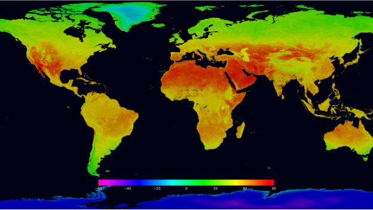
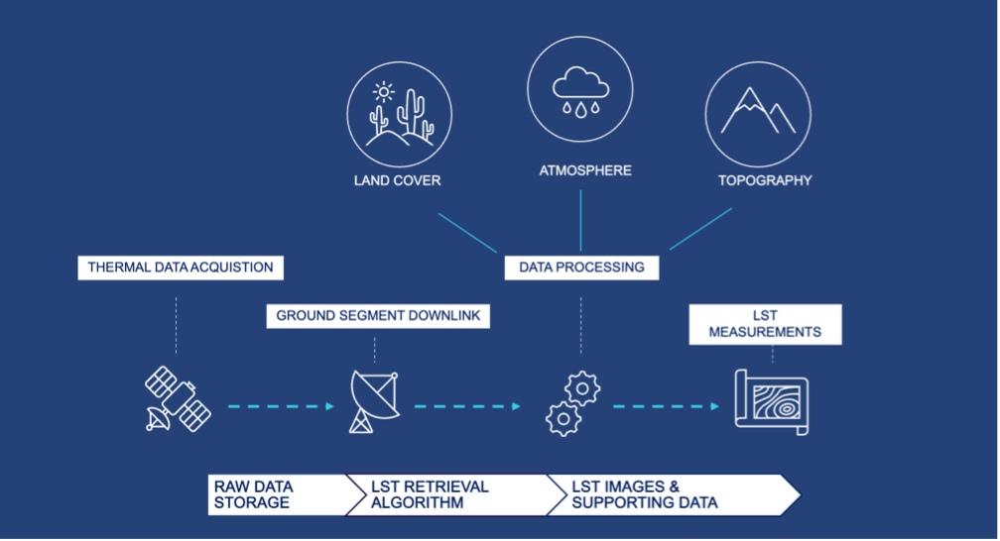
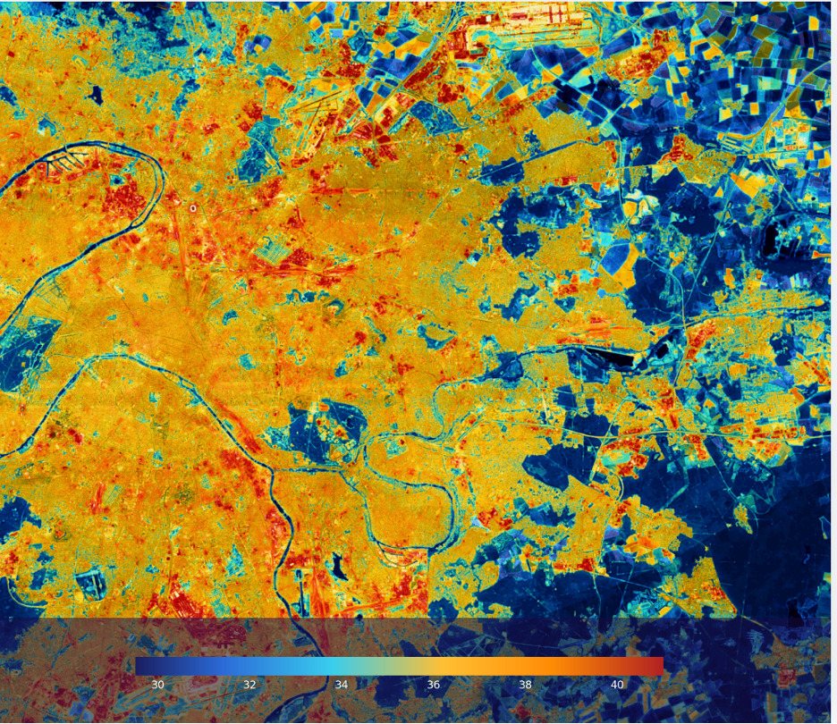
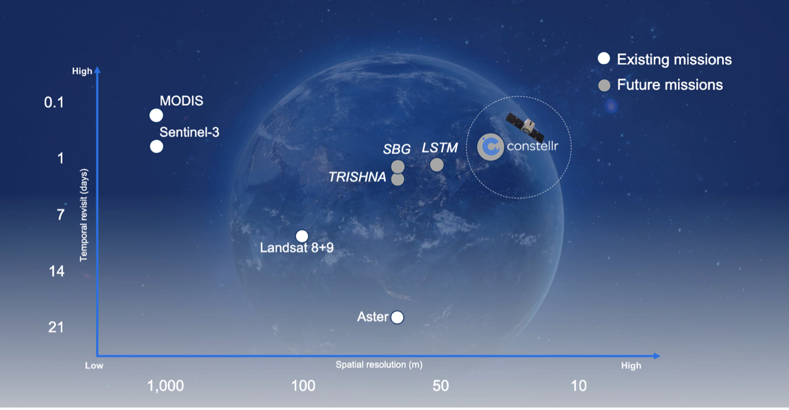

#**Introduction to LST**
<h2 <em>The Power of Land Surface Temperature: What Makes It Important, and Which Spatial Scale Drives Solutions?</em></h2>

<h2>The importance of LST</h2>  

[Land surface temperature (LST)](https://earthobservatory.nasa.gov/global-maps/MOD_LSTD_M) measures how hot the Earth's surface feels at a specific location. This temperature is quantified using thermal and optical sensors such as those of constellr. From a satellite’s perspective, the "surface" could be anything visible from space—snow, grass, rooftops, or forest canopies. So, LST differs from air temperature measured by local stations, by soil sensors, or reported weather data and forecasts. 

Scientists monitor LST because it affects and is affected by weather and climate patterns. They track how rising greenhouse gases influence LST and how changes in LST impact glaciers, ice sheets, permafrost, and vegetation. 

Farmers often rely on spectral vegetation indices to assess irrigation needs and monitor crop water stress. However, they can also use LST maps to evaluate crop water requirements during summer heat and to identify areas at risk of frost damage in winter. 

City planners utilize LST data to assess urban heat islands and leverage insights for infrastructure planning.  
  

<figcaption>Daytime LST monthly composite map, constellr (leveraging a fusion of public data)</figcaption>

<h2>How does constellr obtain LST from its thermal sensors?</h2>  

Through the "High-Precision Versatile Ecosphere" (HiVE) monitoring mission, constellr is developing a unique satellite constellation designed to measure LST. These satellites, equipped with visible and near infrared (VNIR, link to previous article) as well as thermal sensors, will help measure how warm the Earth's surface is. Using special sensors, constellr captures the heat emitted by the surface in very detailed images, showing the thermal data of areas as small as 30 meters wide (30-meter resolution) while VNIR provides information for 10m resolution. 

<figcaption>LST data retrieval process</figcaption>

The thermal sensors detect heat (infrared radiation) and turn it into an electrical signal, which shows how hot the surface is. This signal's strength is proportional to the heat emitted by the surface observed by the satellite. The captured signal follows a journey of a series of steps: 

1. The data reaches constellr’s ground segment then are processed using constellr’s land surface temperature retrieval algorithm. 
 
2. There are various datasets used to retrieve LST including atmospheric conditions during data acquisition, the land cover type as captured by constellr’s optical sensors, as well as topographical data. 
 
3. The processed data is further transformed into heatmaps, where each pixel represents a specific temperature. One can visualize temperature distribution across areas by attributing colors to various temperature levels, making it easy to identify patterns like hot spots or cooler zones. 

<figcaption>Land surface temperature image of Paris and its surroundings, showing a temperature story of space and time. LST was retrieved and enhanced by constellr’s in-house technology (thermal data acquired by Landsat, courtesy of USGS/NASA)</figcaption>

<h2>Why do we need 30-meter resolution for our thermal satellite images?</h2>

From the beginning of constellr’s journey in defining the satellite and sensor specifications, user requirements were collected and analyzed. Understanding the needs of various sectors from the agricultural, natural, and urban environment was essential to design the system according to the needs of those end-users. The requirements emphasized the need of detail in the acquired data as well as a certain level of spatial coverage and revisit time, Accordingly, constellr prepared for the specifications of its instruments, including the spatial resolution of the acquired images. 

constellr’s VNIR sensors allow us to see a real-color view of our area and provide the possibilities to emphasize vegetation using near-infrared bands. These datasets are of 10m resolution. On the other hand, taking thermal images at very high resolution is challenging because of a phenomenon called *diffraction*, which affects how light behaves. To take sharper images in thermal wavelengths, the satellite needs a bigger lens. The size of the lens depends on how high the satellite is, and the type of light being used.  

constellr’s 30 m resolution propriety data acquired by HiVE satellites provide a great balance of detail, accuracy, revisit, and coverage, thus allowing for valuable data for local and regional scale of thermal intelligence. 

This is a great leap forward when compared to the resolutions offered by operational public missions imaging in thermal infrared. For example, geostationary SEVIRI, sun-synchronous Landsat, and ECOSTRESS that is orbiting the Earth on the international space station are examples of such great public missions.  

Yet, they have resolutions ranging from a few kilometers to approximately 70 m per pixel, with a tradeoff between resolution and revisit time. Even future public missions will not acquire data reaching constellr’s 30m spatial resolution. Figure 4 shows a selection of sun-synchronous public missions, i.e. that pass over the same part of the Earth at the same local solar time and how the resolution and revisit time compare to constellr’s data from its HiVE constellation. 

<figcaption>Overview of a selection of sun-synchronous thermal imaging spaceborne public missions</figcaption>

<h2>Thermal intelligence – unlocking new insights</h2>

By leveraging our proprietary high-resolution data, we empower customers to explore their areas of interest in ways never before possible, unlocking insights and analytics that were previously out of reach.  

constellr’s data therefore unlocks capabilities and information that weren't available before:  

- **Trend analysis**: track long-term changes in a reliable manner for better decision-making. 
- **Large-scale mapping**: cover vast areas for better understanding and decision-making 
- **Granular detail**: zoom in for precise, small-scale analysis. 
- **Data integration**: combine thermal and optical data for a fuller perspective. 

By integrating urban, agricultural, and natural environment use cases, constellr improves decision-making with a comprehensive environmental view across sectors. 