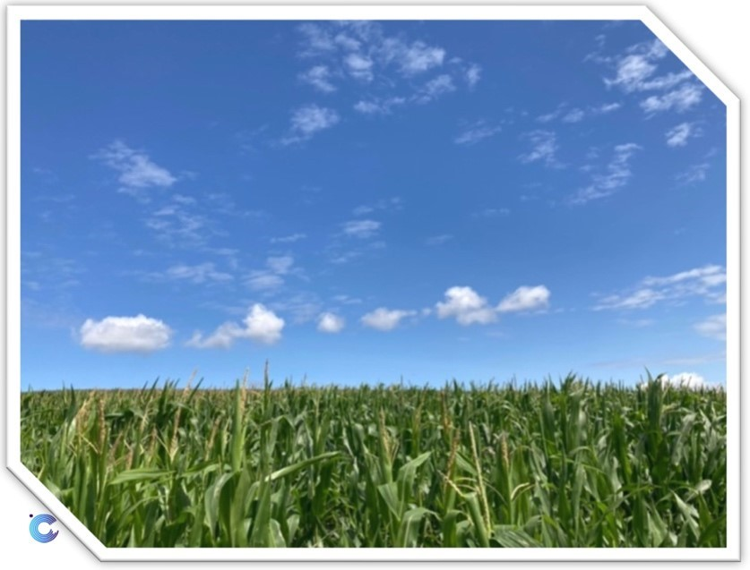
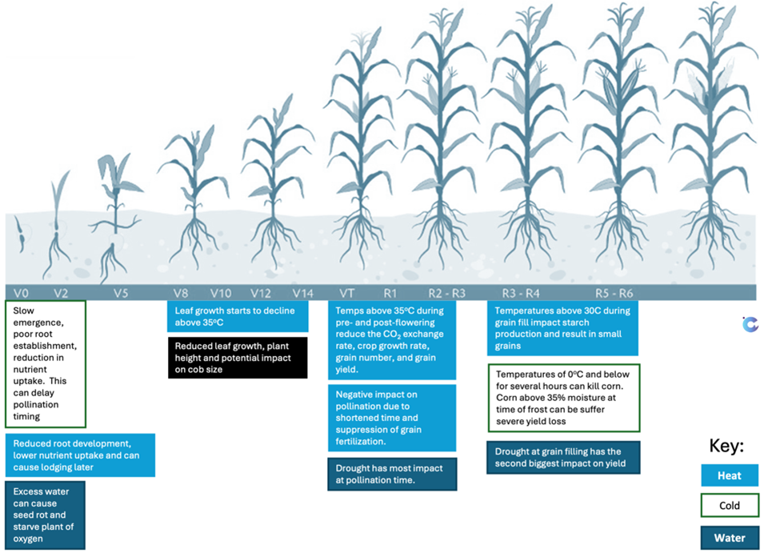
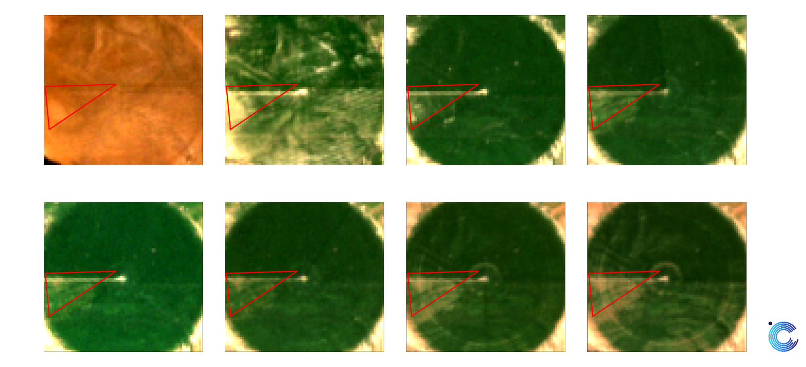
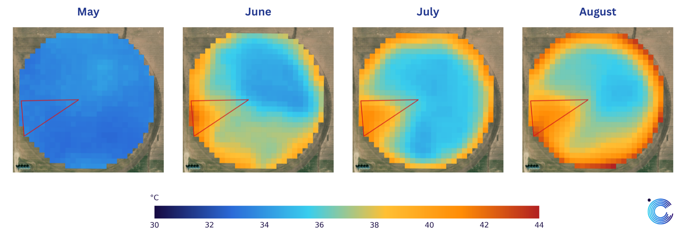

<h1 Detecting water stress using spaceborne LST </h1>
<h2 style="margin-top: 10px; margin-bottom: 10px; color: #24398F;"><em>Crop Stress Monitoring</em></h2>

 

    
    <figcaption style="font-size: 14px;">Figure 1: A corn field after canopy closure   (photo credit Charlie Siggs)</figcaption>

    

    In the vast fields of corn across the United States, growing successful crops depends on detecting problems early (<strong>Figure 1</strong>). In such fields, water stress is one of the most common challenges, but it is not always easy for the land manager to spot. A section of the field might start to struggle, but by the time the signs are visible, it might already be too late to fully recover. Fortunately, constellr’s spaceborne technology is changing how farmers can manage their fields. Satellites equipped to measure land surface temperature detect subtle heat changes caused by water stress, often long before it is noticeable from the ground. This story demonstrates the detection of water stress using land surface temperature using <a href="lst30.md"><strong>constellr’s LST30 product</strong></a>  and a story of satellite data capturing the faint heat signals of stress before the harvest suffers. 
    

  

In many parts of the United States, corn fields are circular, shaped by the sweeping arms of center-pivot irrigation systems. These systems rotate around a central point, delivering water evenly across the field to support the crop's growth. From above, these circular fields look like giant green disks against the earth’s surface (**Figure 2**). Satellites capture this unique geometry while also providing detailed information about the field's condition.  

    
    <figcaption style="white-space: nowrap; font-size: 14px;">Figure 2: Circular corn fields as viewed from the ground and from space </figcaption>

 

    

    The corn begins as tiny green shoots, gradually growing into tall plants with broad leaves that form a thick, protective canopy. Over time, tassels appear at the top, signaling pollination, and soon after, the corn cobs develop, hidden in their husks until harvest. Using vegetation indices like NDVI (Normalize Difference Vegetation Index) from space, one can follow the field’s greening and growth stages. NDVI provides an indication of where there may be issues. Yet, when there is a large amount of vegetation, NDVI tends to saturate. Corn with comparable NDVI values could actually be in very different states.  This would be comparable to someone looking for a new house, by only looking at the price. For the same price, you can rent a small apartment in a city center, or a larger house in the countryside. The price alone is thus a poor proxy for localisation and size. 
    

    
    <figcaption style="font-size: 14px;">Figure 3: NDVI time-series of a corn field   in Kansas, USA</figcaption>

 

On the other hand, it is essential to understand the importance of temperature and water at different growth stages (**Figure 4**). During healthy growth, the corn canopy cools the surface by shading the soil and releasing moisture through transpiration. At critical times, such as crop establishment or pollination, further information, such as field level meteorological or field-sensor data are needed to understand the crop status.  This data can be provided through in-field weather stations and soil sensors, but these are limited by cost and area of coverage. 

{: style="height:450px"}
<figcaption style="font-size: 14px;">Figure 4: The different growth stages of corn and the phases where temperature and water are critical </figcaption>

 
Considering one field that has a sector that is not well irrigated in the red triangle shown in **Figure 5**, we can detect this stress using thermal data before you can catch it with a vegetation index such as NDVI. 

{: style="height:250px"}
<figcaption style="font-size: 14px;"> Figure 5: Timeline of a corn field after canopy closure with a segment that is not well irrigated (bounded by the red triangle) </figcaption>

{: style="height:250px"}
<figcaption style="font-size: 14px;"> Figure 6: LST maps of the field showing the temperature variation with the segment of the fields that is not well irrigated shown in the red triangle </figcaption>

By using just a few thermal images of [**constellr’s LST30**](lst30.md), acquired during the early vegetation growth stage of corn (from June 11 to June 28), LST can already identify a substantial portion of pixels deemed abnormal throughout the entire vegetation growth period (indicated by the red triangle, **Figure 6**). On the other hand, NDVI needed additional images (from June 11 to July 22) to flag a significant number of pixels as abnormal. Using machine learning techniques, such as One-Class Support Vector Machine (OC-SVM), patterns can be identified in an automated manner where anomalies that deviate significantly from the norm within a corn field can be detected.  

This implies:

- Land Surface Temperature (LST) provides valuable insights into biophysical parameters, moving us from proxies to direct measurements. 
- While NDVI reveals how the crop looks on the surface, it does not explain what is happening beneath or why it looks that way. 
- By combining LST with indices like NDVI, we gain a more holistic view of the crop canopy. 

For example, when parts of a field experience water stress, the plant stomata close, causing those areas to warm up, and thus subtle heat signatures that can be observed from space. By analyzing these satellite observations at each stage of a crop’s life cycle, such as corn, we can detect stress early and help farmers take action to maximize their yields.  

  With LST30, we can identify these issues early and precisely. In 2025, even more powerful datasets will be available. We look forward to quantifying the major improvements of the outcome with LST fusion to monitor large areas of corm, LST precision to obtain the highest accuracy and sensitivity, as well as LST zoom for the greatest details.

---

Special thanks to Charlie Siggs, Nicolas Chamberland, Loic Quertenmont, Elsy Ibrahim, Rosa Schmidt, and Yan de Paoli for their valuable contributions to this study and its documentation. Their insights, dedication, and support played a key role in shaping this work.  

 
<h2 style="margin-top: 10px; margin-bottom: 10px; color: #24398F;">Download demo data</h2>
The demonstration data provides you with csv files containing data for a one-year-timeseries of 1) LST data for the water-stressed field section, 2) LST data for the well-watered field section, and 3) the NDVI mean and quantiles for the whole field. 

Lst 2022 time series for a stressed portion of the field 

LST 2022 time series for the well watered part of the field  

NDVI mean (and quantiles) of the field  